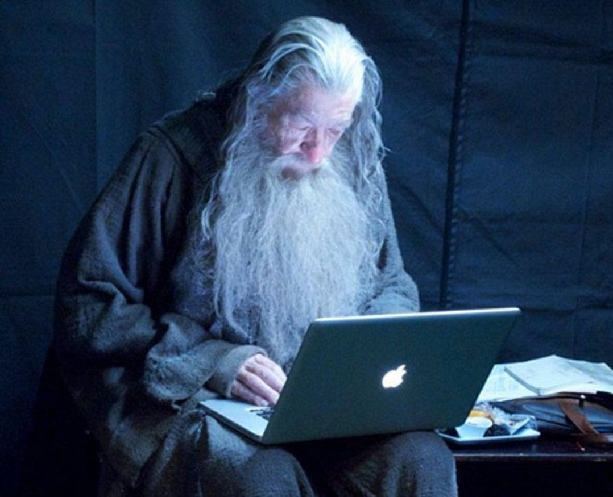

# This is my blog! 

My goal with this was to build a **cool portfolio** with **statically rendered markdown** content that can be hosted for free on **GitHub pages** and use **GitHub actions** for deployment, and that's pretty much been completed. (I also wanted to learn **Svelte**).

So, if you're looking for a quick setup for a site like that feel free to fork this repo and make it your own :)

